# Tutorial "Language Engineering with The GEMOC Studio" at MODELS 2017

* [Scope](#scope)
* [Program](#program)
* [Materials](#materials)


This tutorial provides a practical approach for developing and integrating various Domain-Specific (modeling) Languages (DSLs) used in the development of modern complex software-intensive systems, with the main objective to support abstraction and separation of concerns. The tutorial leverages on the tooling provided by the GEMOC studio to present the various facilities offered by the Eclipse platform (incl., EMF/Ecore, Xtext, Sirius) and introduces the advanced features to extend a DSL with a well-defined execution semantics, possibly including formal concurrency constraints and coordination patterns. From such a specification, we demonstrate the ability of the studio to automatically support model execution, graphical animation, omniscient debugging, concurrency analysis and concurrent execution of heterogeneous models. The tutorial is composed of both lectures and hands-on sessions. Lectures introduce the foundations of language engineering, and give the basics of the GEMOC studio and the underlying concepts. Hands-on sessions allow participants to experiment on representative concrete use cases.

## Scope

During this tutorial, the participants will extend a given finite state machine DSL in terms of syntax and semantics using the language workbench of the GEMOC Studio.


## Legend

* :warning: Read carefully, tricky details follow.
* ​:no_entry: Breaking changes. You should download a new version of the language under development for temporal reasons. You may proceed with you local changes, but we might not be able to support its evolution due to the short time frame of the tutorial. 

## Program

- (30min) [Part 1. General introduction](#part-1-general-introduction)
- (1h) [Part 2. Building a simple finite state machine language for XXXX](#part-2-building-a-simple-finite-state-machine-language-for-xxxx)
  - [2.1 Running the FSM example](#21-running-the-fsm-example)
  - [2.2 Adding new concepts to your language](#22-adding-new-concepts-to-your-language)
  - [2.3 Complementing the dynamic semantics](#23-complementing-the-dynamic-semantics)
  - [2.4 Defining concrete syntax with Sirius](#24-defining-concrete-syntax-with-sirius)
- (1h) [Part 3. Complementing your finite state machine language with a formal concurrency model](#part-3-complementing-your-finite-state-machine-language-with-a-formal-concurrency-model)
- (30min) [Part 4. Wrap-up and discussion](#part-4-wrap-up-and-discussion)


## Materials

+ Use either the latest [GEMOC Studio](http://gemoc.org/studio.html) and with a [Java 1.8 JDK](http://www.oracle.com/technetwork/java/javase/downloads/jdk8-downloads-2133151.html) and clone the [tutorial's repository](https://github.com/gemoc/ICSA2017Tutorial.git) or use [prepared virtualbox machine](http://gemoc.irisa.fr/pub/studio/vm/Lubuntu%2064%20GEMOC%202.3.0.a.ova).
+ The slides for the tutorials are available on [here](https://github.com/gemoc/ICSA2017Tutorial/blob/master/slides/tutorial-mcgill-slides.pptx). Additional slides are available [here](https://github.com/gemoc/ICSA2017Tutorial/tree/master/slides/additional).
+ Most of the documentation on the GEMOC approch is available [here](http://gemoc.org/gemoc-studio/publish/guide/html_single/Guide.html).

You can refer to the documentation at any time.


## Part 1. General introduction

This part introduces the structure and goals of the tutorial. Moverover it covers an introduction to software language engineering, GEMOC Studio and the GEMOC initiative. The slides are available [here](https://github.com/gemoc/ICSA2017Tutorial/blob/master/slides/tutorial-mcgill-slides.pptx).


## Part 2. Language engineering

In this part, you will - due to temporal restrictions - extend the metamodel and semantics of a language for finite state machines (FSM). In the first step, you will load the projects implementing the language into the language workbench, start the modeling workbench, and execute/debug an FSM. Afterwards, you will extend the metamodel of the FSM language with three new concepts related to FSM variables and their usage. Then you will add behavior of these new concepts to the language, and add a new concrete (graphical) syntax to them.


### 2.1 Running the FSM example

- Open your GEMOC Studio
- Go to a new workspace.
- Go to File -> new -> Example -> Select GEMOC FSM Language (Sequential)

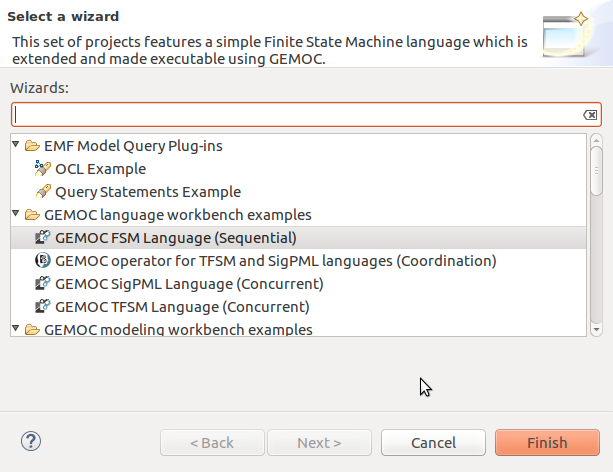

This produces the general structure of a (x)DSL project, which comprises the projects for your static language (projects org.gemoc.sample.legacyfsm.fsm.*) 

-  *org.gemoc.sample.legacyfsm.fsm.model* Contains the metamodel of your language 
-  *org.gemoc.sample.legacyfsm.fsm.model.edit* Contains the edition helper classes of your metamodel (reused by many  textual, tree, or graphical editors and Eclipse outline)  
-  *org.gemoc.sample.legacyfsm.fsm.model.editor* Generate a generic tree based editor for your FSM Model 
-  *org.gemoc.sample.legacyfsm.fsm* Contains the DSL description Melange model for your FSM language 
-  *org.gemoc.sample.legacyfsm.fsm.design* Contains a graphical representation description for you FSM model Sirius based  


and their executable counterparts (projects org.gemoc.sample.legacyfsm.xsfsm.*)

- *org.gemoc.sample.legacyfsm.xsfsm* Contains the DSL description Melange model for your XSFSM language 
- *org.gemoc.sample.legacyfsm.xsfsm.design* Contains graphical representation extension for you XSFSM model Sirius Animator  
- *org.gemoc.sample.legacyfsm.xsfsm.trace* Contains the generated project for efficient executable trace management 
- *org.gemoc.sample.legacyfsm.xsfsm.xsfsm* Generated executable FSM metamodel resulting from the *org.gemoc.sample.legacyfsm.xsfsm* language specification melange file


#### Playing with the language

1. Start a modeling workbench

   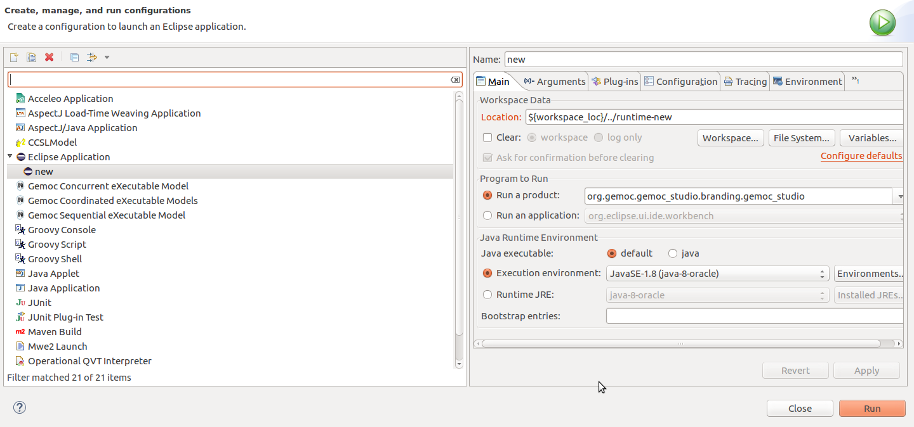

   ​

2. Get the example for (GEMOC model for FSM Sequential)

   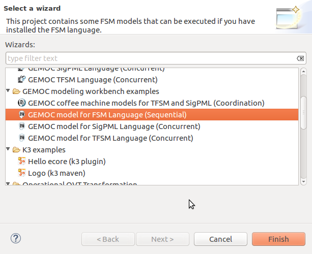

- Open the *bitshifting.aird* file: there you can see and edit the FSM model.

Next: Run this model. To this effect, open the *run* dialog:

- Run in **debug mode** the **BitShifting.fsm 000101010** run configuration.

You then can play with the debug model by stepping through it and observing the state transitions.

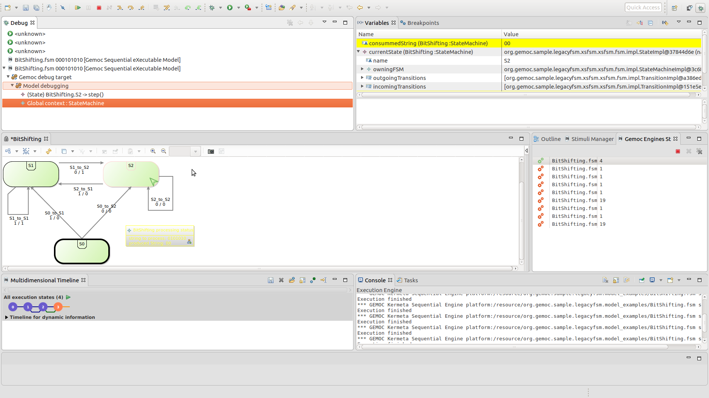

​:warning: You can now close the modeling workbench


### 2.2 Adding new concepts to your language

Just open your FSM metamodel (in project *org.gemoc.sample.legacyfsm.fsm.model*) in the language workbench either using the graphical editor via fsm.aird or using the tree-based editor via fsm.ecore. 

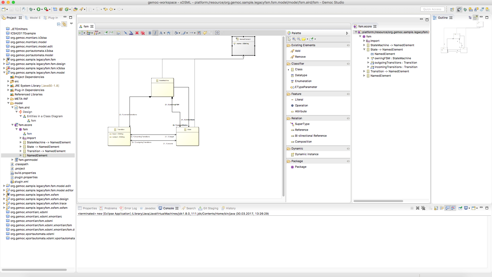

1. Add the concept of `Variable` that has a name to the FSM. Add the subclasses : a `StringVariable`, `BooleanVariable`, and a `NumberVariable`as depicted below:

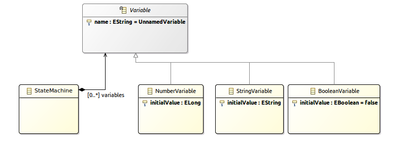

2. Add the concepts of Guards and Actions to the Transition as depicted below

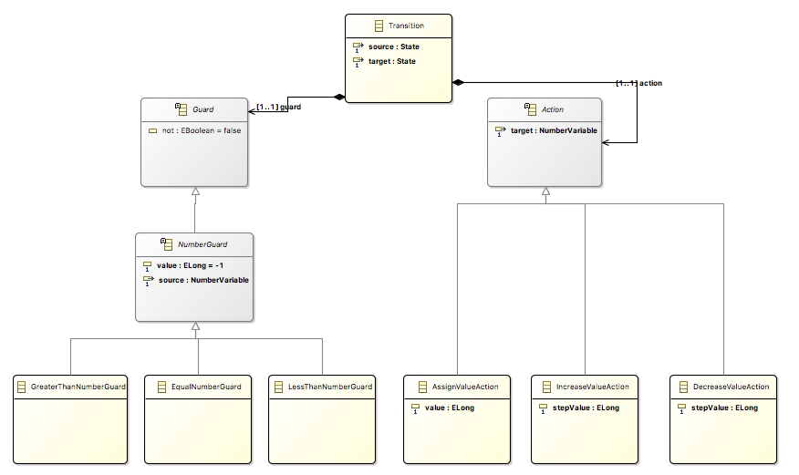

​:warning: At the end of this task, you must regenerate the Java code for your metamodel. Right click on the *fsm.genmodel* in the same folder as the metamodel and select reload. Next, open it and in the tree editor, right click and select *generate all*.

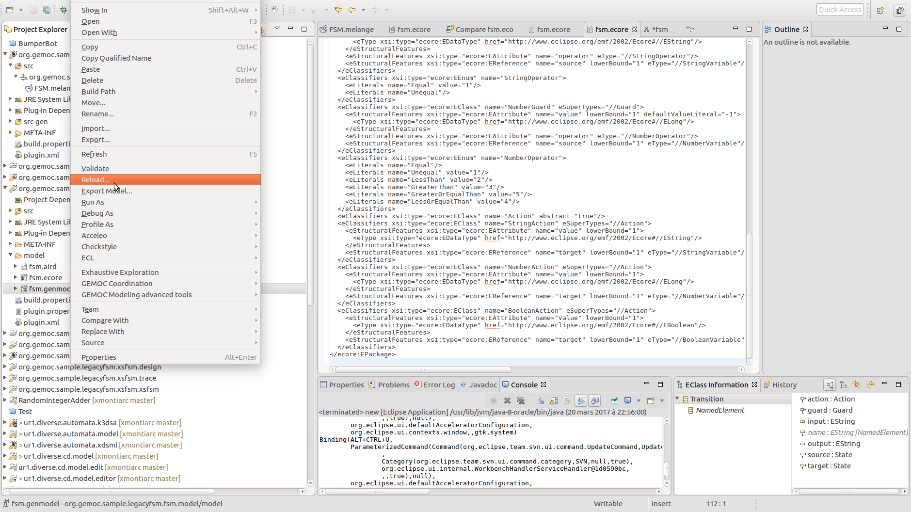

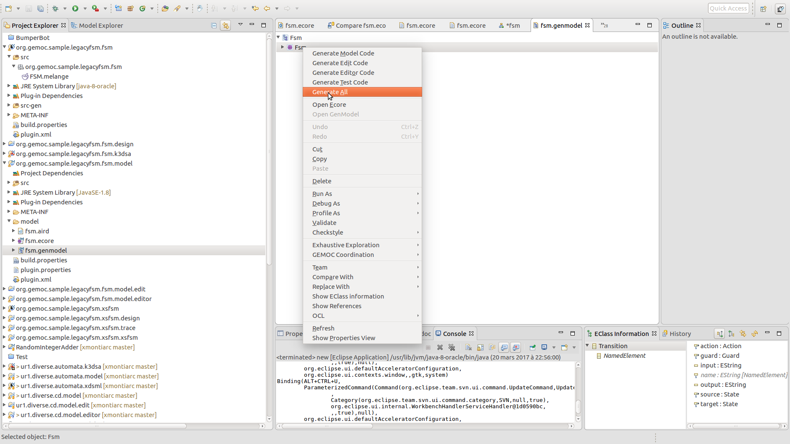

** mettre juste une note **

#### Adding OCL constraints

:no_entry: The result of the previous step is available from the [folder 2.2-ocl](https://github.com/gemoc/ICSA2017Tutorial/tree/master/code/2.2-ocl). Please download it if you encountered problems in adding the new concepts to the FSM metamodel.

In our language, you can define your static semantics (i.e., well-formedness rules) using OCL. Let us try to define that a state cannot have two outgoing transitions without a guard. To this effect, open the metamodel with the *OCLinEcore editor* via right clicking it and selecting that editor. Here, you can create an `invariant` for the concept `State` that restricts its outgoing transitions.

+ The official OCL documentation is [available online](http://download.eclipse.org/ocl/doc/5.0.0/ocl.pdf) as well as there is a comprehensive [set of slides on it](https://de.slideshare.net/EdWillink/enrich-your-models-with-ocl).
+ A tutorial on the OCLinEcore editor is available from the [eclipse wiki](https://wiki.eclipse.org/OCL/OCLinEcore) and a getting started guide is available from the [eclipse help website](http://help.eclipse.org/neon/index.jsp?topic=%2Forg.eclipse.ocl.doc%2Fhelp%2FGettingStarted.html).

##### Example: Invariant to check uniqueness of names

```OCL
invariant uniqueStateNames: 
	self.states->forAll(s1, s2| s1 <> s2 implies s1.name <> s2.name);
```

After creating the *invariant* for the *State* concept, start the modeling workbench again and open the **BitShifting** model again. Right click on it and select validate. Now eclipse marks all states as erroneous as none uses a guarded transition.


### 2.3 Complementing the dynamic semantics

:no_entry: For temporal constraints, we provide an implementation of the FSM dynamic semantics. We suggest, to restart from the FSM version in the [folder 2.3](https://github.com/gemoc/ICSA2017Tutorial/tree/master/code/2.3-execution). Prior to that, delete all projects from your workspace (or switch to another workspace). 

The operational semantics of FSM are defined in the file tfsmAspects.xtend of project org.gemoc.sample.legacyfsm.fsm.k3dsa. This file which employs [Kermeta 3 (K3)](http://www.kermeta.org) and the [Interpreter Design Pattern](https://en.wikipedia.org/wiki/Interpreter_pattern) to describe the dynamic behavior of FM models and its contents is woven into the metamodel of your executable DSL (i.e., XSFSM, not FSM!). In this file, you have aspects for all classes of your metamodel. Some of these aspects use annotations to define execution functions or entry points. 

**Execution Functions**

The Execution Functions define how the Execution Data evolve during the execution of the model. Execution Functions can be implemented by defining the body of a method. These methods must be annotated with the **@Step** annotation. Whenever a method with an @Step annotation returns, the changes in the model will be applied (via a transaction) to the resource. This means that the changes will be visible from an animator. K3 supports nested @Step annotation calls so that changes in the model will be applied when entering and leaving methods having these annotations.

**Entry Points**

The GEMOC sequential engines uses methods annotated with **@Main** as entry points to model execution. This annotation must be placed on operations applicable to model elements considered as the model starting point (Often the root model element).

We left two methods unimplemented with "TODO". Try to implement these two methods.

After finishing, run "generate all" on the Melange model of project org.gemoc.sample.legacyfsm.xsfsm, which generates a new language implementation.

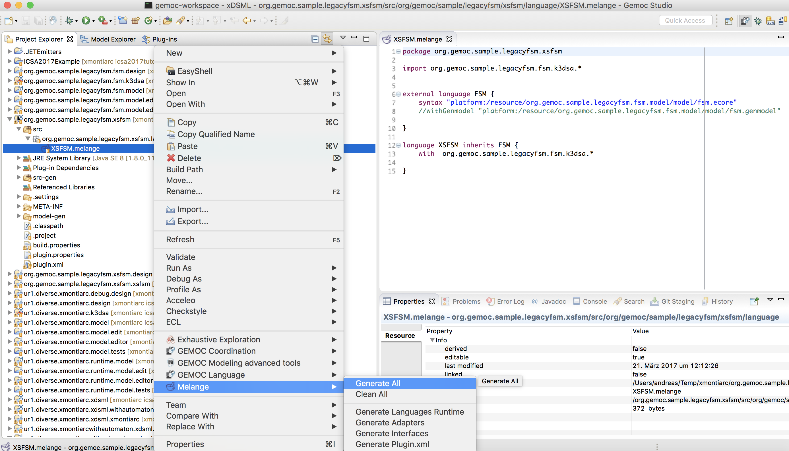

Note how Melange has woven the methods defined in the aspects into the XSFSM metamodel defined in XSFSM.melange of *org.gemoc.sample.legacyfsm.xsfsm*.

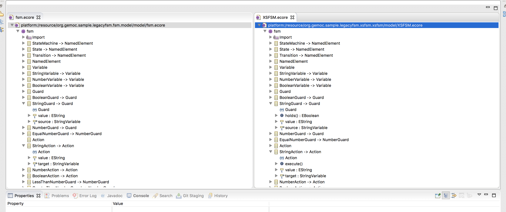


#### Testing the execution of the model with its new semantics

:no_entry: The solution of the previous step is available from the folder [2.4-sirius-start](https://github.com/gemoc/ICSA2017Tutorial/tree/master/code/2.4-sirius-start). Please download it and let's run the modeling workbench on top of these projects.

Create a FSM model with two steps and one transition. Create a variable `a` with `1` as an initial step. Create a guard associated to the transition that checks whether `a == 1`.  Create an action that assigns `2` to the variable `a`.

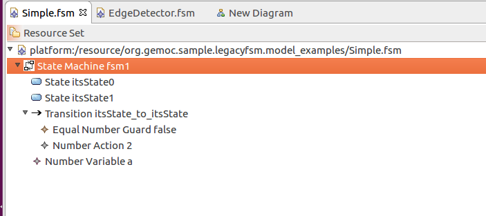

Let's debug/animate this model!

1. Create the debug configuration


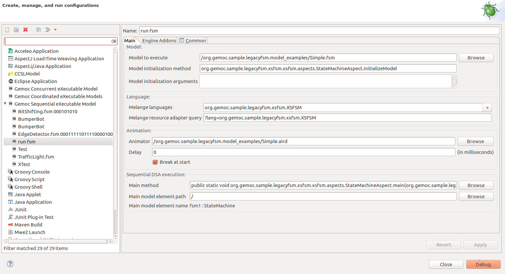

2. You can then debug your language

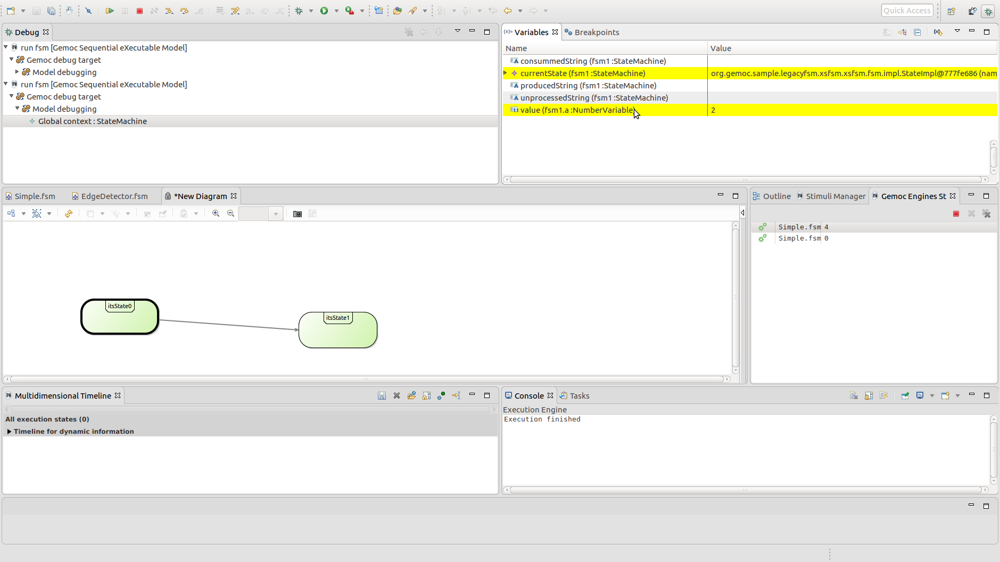


### 2.4: Defining concrete syntax with Sirius

In this step, you will define the graphical concrete syntax for a specific modeling element of the FSM language using [Sirius](https://www.eclipse.org/sirius/doc/specifier/diagrams/Diagrams.html). 

:no_entry: For temporal restrictions, we have prepared the state of FSM so far in the folder [2.4-sirius-start](https://github.com/gemoc/ICSA2017Tutorial/tree/master/code/2.4-sirius-start). Please remove your projects from the workspace (or switch to another workspace) and import the projects from this folder.  

As you have added variables, guard, and actions to the metamodel, these should be rendered also. The following figures shows the intended result in action. Transitions display guards and actions, the FSM has a container displaying the current variables values, and the currently touched elements are highlighted during execution.


In *description/XSFSM.odesign* of project *org.gemoc.sample.legacyfsm.xsfsm.design*, you'll find the Sirius designer model that renders the concrete graphical syntax of your language in the modeling workbench. This designer model is connected to your metamodel as depicted below:


This designer model comprises three views: a default view that renders the structural parts of your models, a debug view that overlays the structural parts with information from the debugging process (such as variable values), and an animator view that enables adding domain-specific animations.

- For rendering guards and actions, please adjust the labels of transitions accordingly. To this effect, investigate how the properties of "Event Transition" are mapped to methods of the class `XFSMServices` and adjust the employed methods accordingly.
- For the variables, we want to display their current values. To this end, create a container for variables in the animation view that can contain variables which are represented by labels as depicted by the next three figures.

Please refer to the [Sirius documentation](https://www.eclipse.org/sirius/doc/specifier/diagrams/Diagrams.html) for learning how you can configure in details your editor.


The container for variables with its properties:


The node for variables with its properties:

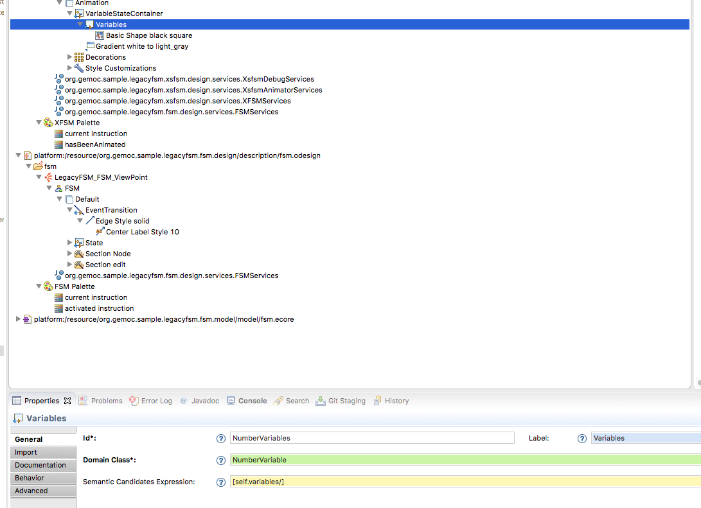

The label rendering information on variables with its properties:


The label receives its text from the registered services. Depending on the view, the services render either the variables' initial values (default view) or their current values (debugging view). Please have a look at the classes `FSMServices` and `XFSMServices` and investigate how this is achieved.

Let us import an example model from the project [ICSA2017Example](https://github.com/awortmann/xmontiarc/tree/icsa2017tutorial/ICSA2017-FSM-Example) to debug a model with your new representation. In this project, open the file */models/HeatingController.aird* and in the project explorer, open the HeatingController diagram. See below:

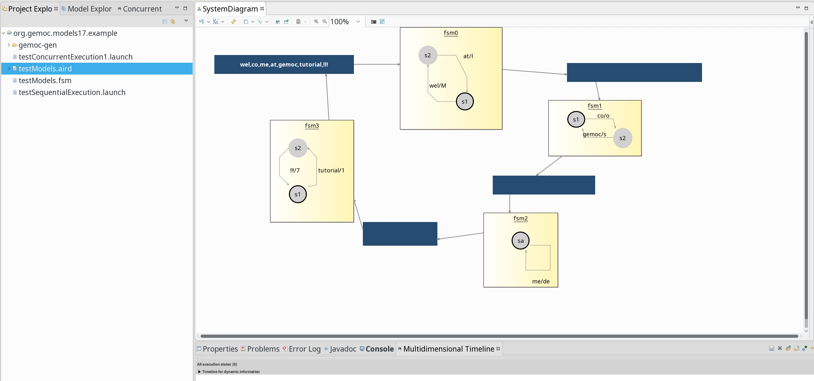

From here, you can run the launch configuration */launch/HeatingController.launch*, as a **debug configuration** and start debugging your model. From the variables view (top right), you can adjust the current temperature to observe different FSM behavior. 

:no_entry: The solution of the previous step is available from the [solution folder](https://github.com/gemoc/ICSA2017Tutorial/tree/master/code/solution), if you had any problems with recreating the new syntax elements, please download it, clear your language workbench workspace and import these projects. Then run the modeling workbench on top of these projects.


## Part 3. Complementing your finite state machine language with a formal concurrency model
### Introduction

In the previous parts you defined an operational semantics for our little communicating FSM language. Based on that you were able to simulate and debug the models that conform this language.
If you have a careful look at the given semantics, you can see that the call to the *run()* of each FSM depends on the order the FSMs are stored in the *ownedFsms* collection. This mean that we restricted the semantics to be sequential and in this specific order. However, as soon as a FSM can read in its input buffer, it can be ran; possibly concurrently with other FSMs. In this section we will replace the *main()* method of our operational semantics to specify the concurrency model of our language.

### Changing the language specification from sequential to concurrent
The first step consists in changing the nature of the language project from sequential to concurrent:
- right click on the *org.gemoc.models17.fsm* project, go to 'Configure' and choose 'Remove Sequential xDSML Project Nature'
- right click on the *org.gemoc.models17.fsm* project, go to 'Configure' and choose 'Add Concurrent xDSML Project Nature'

Behind the scene, the GEMOC studio is creating new artifacts and dependencies to deal with the concurrent execution engine. Please respect the order of the two previous actions to avoid a conflict between the two natures.

### Creation of the DSE and MoCCML mapping project
The second step consists in using the wizards to create a project dedicated to the specification of Domain Specific Events (DSE) and the way they are constrained each other.

- right click on the fsm.melange file, choose 'GEMOC Language' and click on 'Create DSE project for Language' 

A pop-up will open and ask you to configure the project:
- Choose the language to be equipped by a concurrent specification (you should have only one, XFSM)
- Choose the project name, default proposition is fine.
- in the three fields:
	- Choose the XFSM.ecore file by browsing in the first field.
	- Choose the root of the language (i.e., Model::System') in the second field by browsing.
	- Choose the name of the file in which DSE and MoCCML mapping will be specified in the third field (e.g., xFSM)

At this point it creates the new project and complete the *melange* file witht the location of the so called ECL file (For Event Constraint Language). This last file is the one we will modify now. It is based on OCL and borrow most of the syntax from it.

### Modification of the ECL file

the ECL file follows the same format and syntax than OCL files.
It starts with the import of the metamodel on with the concurrency semantics must be given.

Then 2 specific imports are added (*ECLImport*). They are used to import MoCC specific constraint to be used in the ECL mapping. As we will see later, new constraints can be defined to fit the DSML concurrency semantics. For now, we will use the ones predefined in the CCSL librairies. These librairies contains, amongst some others, the following constraints:
- relation Precedes: e1 precedes e2 means that the ith occurrence of e1 arrives before the ith of e2
- relation Coincides: e1 coincides with e2 means that the ith occurrence of e1 arrives synchronously with the ith of e2
- relation Excludes: e1 excludes with e2 means that none of the occurrences of e1 arrives synchronously with one of e2
- expression DelayedFor: res = e1 DelayedFor N on e2 means that for each occurrences of e1 between two occurrences of e2, there is an occurrence of res after N occurrences of e2


## Part 4. Wrap-up and discussion

See slides.
